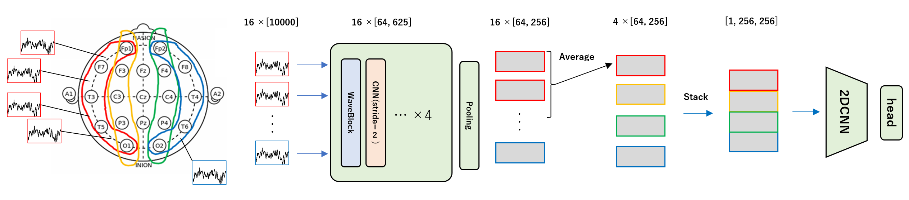

## T.H. part

I developed a wavenet+2dCNN model using only raw EEG.  
Below is an outline of my pipeline.  
I achieved a public LB = 0.25 (cv = 0.244) with a single model.

### pipeline

### Input

- Compute a total of 16 signals by calculating 4 neighboring difference signals each for LL, RL, LP, RP.
- 20Hz butter lowpass filter.
- Clipping of signal intensity.

### Model

- Wavenet+2DCNN.
- For Wavenet, I referred to this [notebook](https://www.kaggle.com/code/alejopaullier/hms-wavenet-pytorch-train "HMS | WaveNet PyTorch [Train]"). Thank you for sharing the code!
- Input 16 signals separately into Wavenet and average the output feature maps within the groups of LL, RL, LP, RP.
- Stack the four feature maps vertically to input into 2DCNN.
- For the 2DCNN model, MaxxvitV2-nano was the most accurate. Maxxvit-small and effnetb4 were also used for the ensemble.

### Training

- 2-stage training:
  - 1st stage: train with all data for 50 epochs (lr=1e-3).
  - 2nd stage: fine-tune with data where n_votes>=10 for 30 epochs (lr=1e-4).
- Optimizer: AdamW.
- Scheduler: Cosine Annealing (+Warmup).
- Augmentations (in order of most effective):
  - ChannelSwap ([LL/LP] <=> [RL/RP]).
  - Inversion (inversion of signal strength).
  - TimeMask.
  - Reverse (time reversal of the signal).
